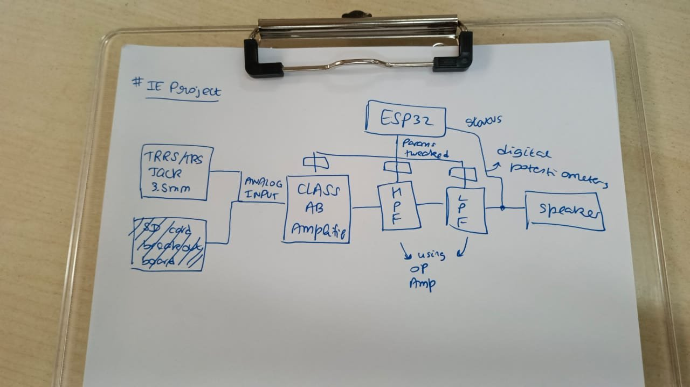
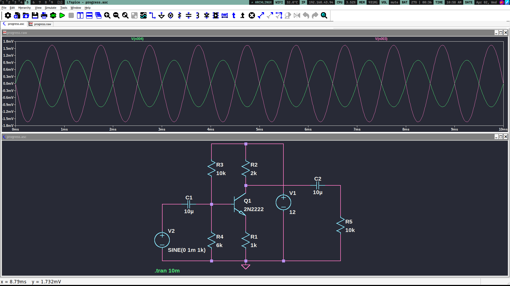

# Preparation

## Choosing Amplifier Circuit

Types of Power Amplifiers

### Class A

- High Linearity
- Very little distortion
- Low efficiency
  - Inefficient
  - Lot of heat generated

### Class B

- Higher efficiency
- Significant distortion
- Push-pull configuration
  - Each transistor dealing with each half of the input waveform

### Class AB

- Most common type of amp
- Moderate efficiency
- Moderate distortion

### Class C

- High efficiency
- High distortion

### Class D

- High efficiency
- Uses pulse width modulation

### Conclusion:

- We will be using the Class AB amplifier circuit since it is a middle ground between efficiency and distortion.
- Furthermore, it is very simple to design requiring only 2 BJTs, 2 resistors, 2 diodes and 3 capacitors.
- It provides an efficiency of 50-78.5%

## Filter

- We will be using Active High pass and Low pass filters made using OpAmps for controling the treble and bass parameters respectively

## Client Side

- ESP32 Web server
- Slider for volume/gain, treble and base input

## Ideation

## 2025-04-02 11:56
- As of now, we are picking which amplifier circuit to use which balances simplicity and efficiency
- The best circuit we have as of now is a BJT amplifier circuit with common base configuration

- Also, the passive filter circuits are theoretically working and the values of R and C have been calculated corresponding to cutoff frequencies for bass and treble
  - Refer to the [PDF](https://github.com/aditya23043/sem4/blob/main/IE/project.pdf)
- I am quite confident about coding the web server since arduino ide provides a lot of helper functions for networking
